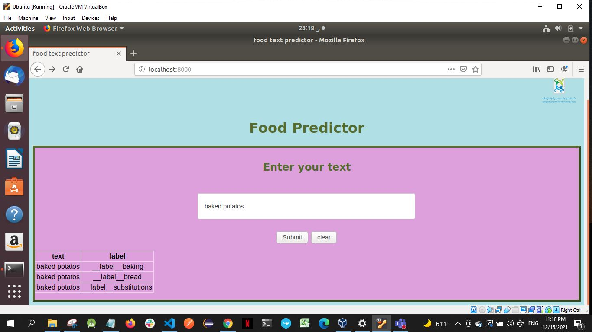

# Workshop2 food text labeling predictions project

## Table of content
- Project overview 
- How to install
- How to use
- Release (0.0.0)(0.0.1)
- Travis CI tool
---

### Project overview
This project is for Software Engineering consists of two tasks which is devided into two realeses. It predicts food through a website for mashine learning


---

### How to install

Download the three files (index.html, index.js, and train.txt) in your ubuntu environment.
Next, follow the steps below to set up a Node js server to run the core system of the machine learning (fasttext tool for text classification) on input from a user.
1. Download npm: sudo apt install npm
2. Create and open project folder: mkdir [your choice name]
3. Initialize requirements: npm init -y
4. Add index.html,index.js and train.txt in the same folder. [check the supplement materials]
5. Install the Node.js sandbox for the Machine learning algorithm (fasttext): npm install node-
   fasttext  --save
6. Install Express: npm install express --save
7. Install some cors issues: npm install cors --save
8. Now if you want to get this sandbox up and running pretty quick you go ahead and use my
HTML and J's files (provided on this URL) and once you have done.
9. Run index.js: node index.js
---

### How to use
using the port provided in the terminal,“localhost:8000”
---
## Release (0.0.0)
![Screen Shot 2021-12-15 at 11 59 03 PM]

## Release (0.0.1)


---

### Travis CI tool 


Travis Continues tool in a tool to set up a build pipeline.
Steps to set up and run Travis CI in the project :

1- Sync your GitHub with travis: [Travis CI](https://www.travis-ci.com/)
2-Select this repository
3-Create .travis.yml file in the repository with the following code i it<br>

```
Language: node_js
Node_js: 
 -7
```
<br>
4-Edit package.JSON file in 

```
"scripts": {
  "test": "echo \"Error: no test specified\" && exit 1"
} 
```
to be 
```
 "scripts": {
  "test": "echo \"No test specified\""
} 
```

5-Done!
[](https://app.travis-ci.com/AlhanoufAlmans/Workshop2)
---
